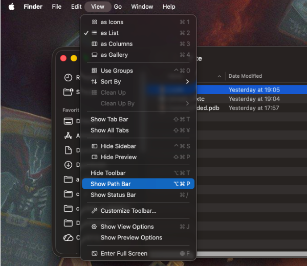
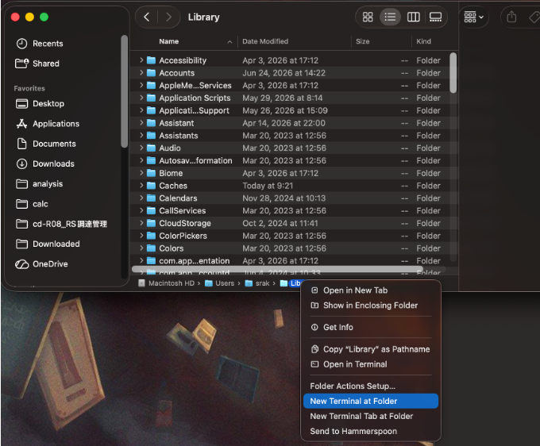
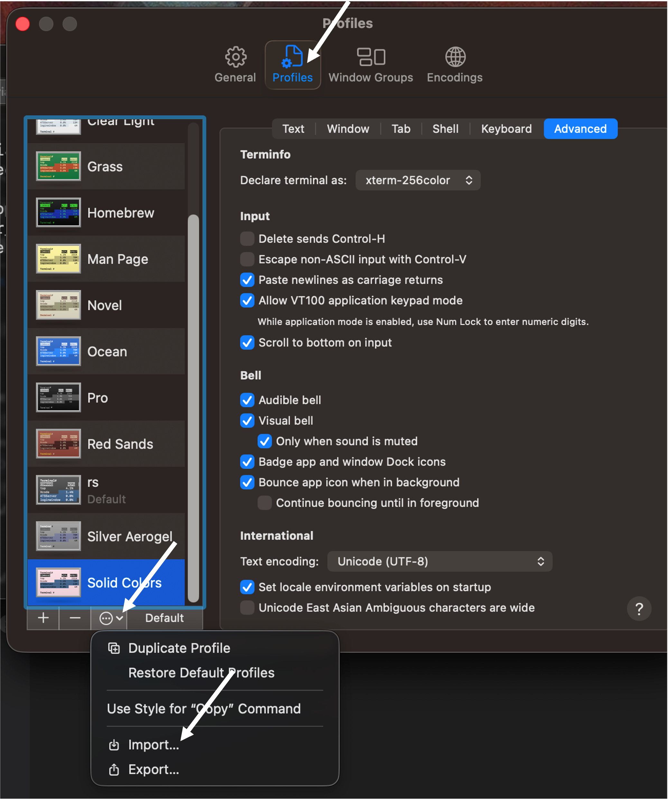

# Mac設定
## Finderの設定
### 1. Path barの表示
- FinderのView → Show Path Barを有効にすることで、現在のディレクトリのパスがFinderウィンドウの下部に表示されるようになります。  
  
- 表示された下のPath barを右クリック → Open New Terminal at Folderを選択することで、現在のディレクトリでターミナルを開くことができます。  
  
  
### 2. [拡張子の表示](https://kb.oism.tottori-u.ac.jp/services/os_manual/show-filename-extentions-macos/)

### 3. (Optional) 隠しファイルの表示
- `command + shift + .`で隠しファイルの表示/非表示を切り替えることができます。  

## (Optional) Terminalの設定
1. 私の設定ファイル{download}`rs.terminal <files/rs.terminal>`をダウンロード
1. Dock or Apps → Terminalをクリック
1. 上部メニューのTerminal → Preferences or Settings （設定）をクリック
1. Profiles → Gear icon → Importをクリックして、ダウンロードした`rs.terminal`を選択  
   
